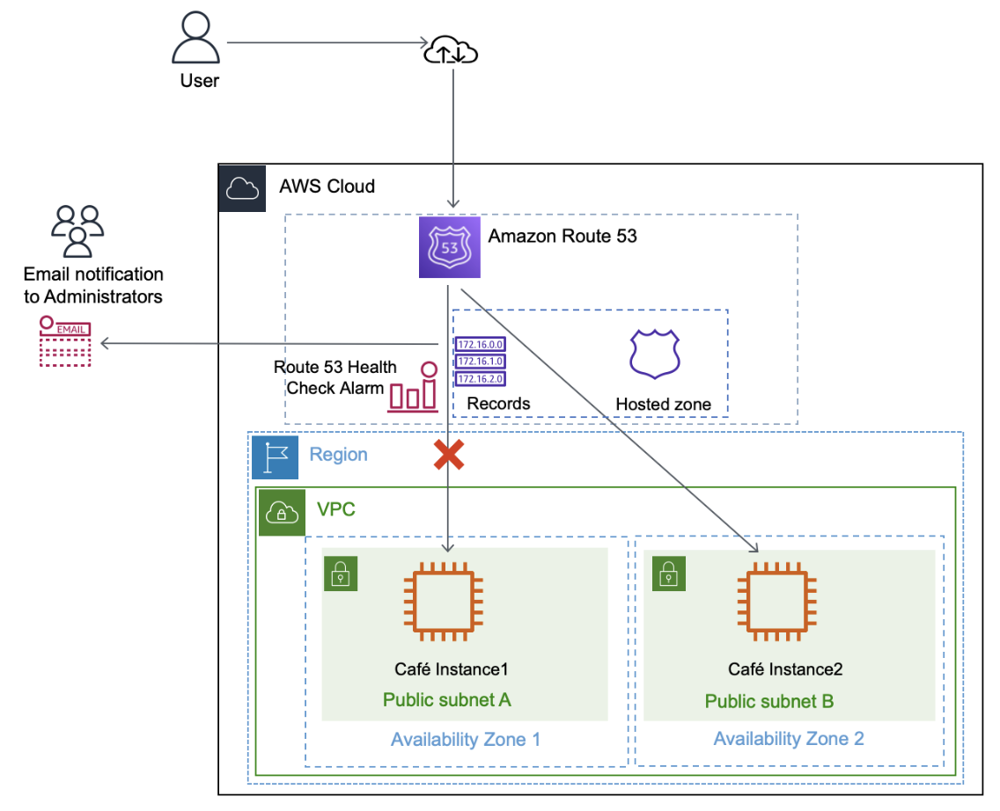
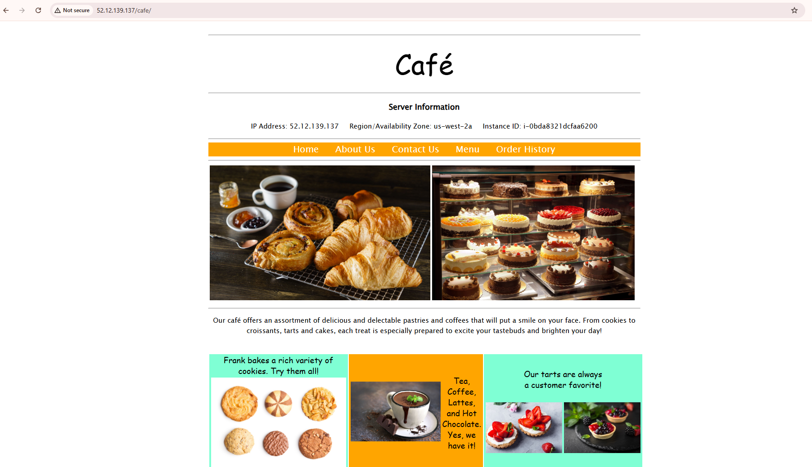
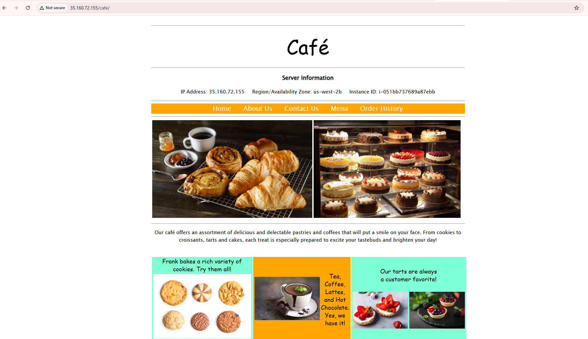
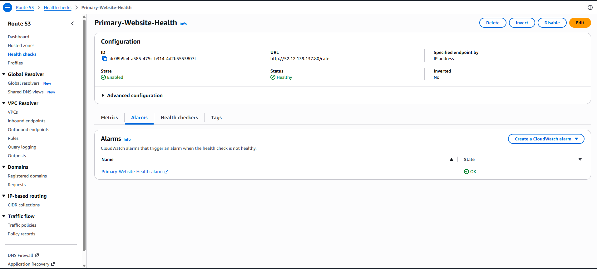
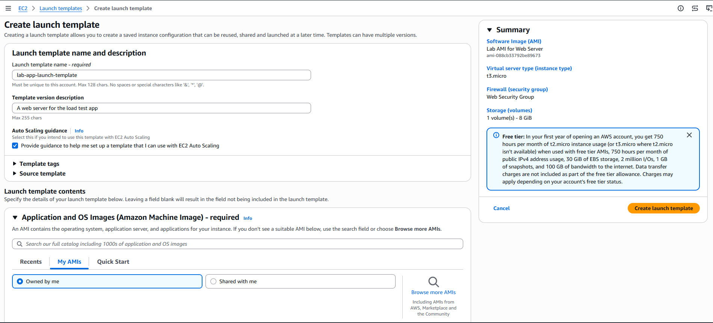
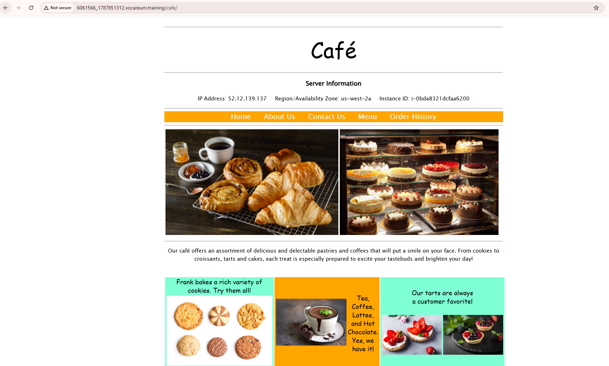
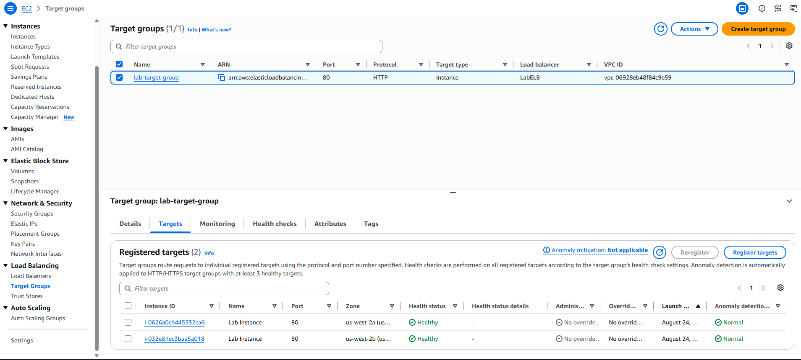
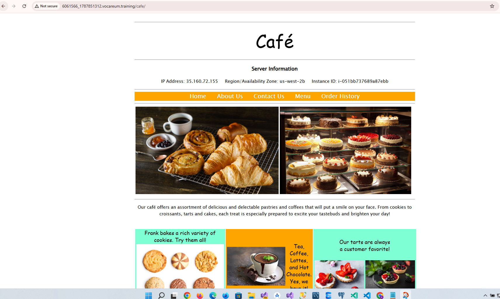

# Amazon Route 53 Failover Routing

## 📌 Lab Overview

In this lab, I configured **Amazon Route 53 failover routing** for a café web application running on two Amazon EC2 instances in different Availability Zones.

The goal was to ensure that traffic is normally directed to the **primary web server**, but automatically fails over to the **secondary web server** if the primary server becomes unavailable.

I configured:

* Amazon Route 53 Health Check
* Amazon SNS email notifications
* Primary and secondary Route 53 A records
* Failover routing policy
* DNS failover testing
* EC2 instance failure simulation

---

## 🏗️ Architecture

The environment contained two EC2 instances:

| Instance      | Availability Zone           | Role                 |
| ------------- | --------------------------- | -------------------- |
| CafeInstance1 | Primary Availability Zone   | Primary Web Server   |
| CafeInstance2 | Secondary Availability Zone | Secondary Web Server |

### Failover Flow

```text
                  

---

# Task 1: Confirming the Café Websites

## Objective

The first task was to confirm that both EC2 instances were running the café application successfully.

I opened the **Amazon EC2 Management Console** and checked the available instances.

The environment contained:

* `CafeInstance1`
* `CafeInstance2`

Both instances were running the café website and were located in different Availability Zones.

### Primary Website

I opened the **PrimaryWebSiteURL** provided in the lab credentials.

The café website loaded successfully, and the **Server Information** section showed the Availability Zone of the primary EC2 instance.

### Secondary Website

I then opened the **SecondaryWebsiteURL**.

The second café website also loaded successfully and showed that it was running on a different EC2 instance and Availability Zone.

### Testing the Application

I opened the café menu, selected an item, and submitted an order.

The order confirmation page loaded successfully, confirming that the application was working correctly.

### 📸 Screenshot

```text

```

```text

```

---

# Task 2: Configuring a Route 53 Health Check

## Objective

The purpose of this task was to create a health check that monitors the primary café website.

I opened the **Amazon Route 53 Management Console** and navigated to **Health checks**.

I created a health check with the following configuration:

| Setting             | Configuration                     |
| ------------------- | --------------------------------- |
| Name                | `Primary-Website-Health`          |
| What to monitor     | Endpoint                          |
| Specify endpoint by | IP address                        |
| Endpoint            | CafeInstance1 public IPv4 address |
| Path                | `/cafe`                           |
| Request interval    | Fast (10 seconds)                 |
| Failure threshold   | 2                                 |
| Create alarm        | Yes                               |
| SNS topic           | `Primary-Website-Health`          |
| Notification        | My email address                  |

The health check monitored the primary web server by sending requests to the `/cafe` path.

### Health Check Result

After creating the health check, I waited for Route 53 to begin monitoring the endpoint.

The health check eventually showed a **Healthy** status.

I also confirmed the SNS email subscription by opening the email from AWS Notifications and selecting **Confirm subscription**.

### 📸 Screenshot

```text

```

---

# Task 3: Configuring Route 53 Records

## Task 3.1: Primary A Record

## Objective

I created an **A record** for the primary café website.

The record was configured with the following settings:

| Setting              | Configuration            |
| -------------------- | ------------------------ |
| Record name          | `www`                    |
| Record type          | A                        |
| Value                | CafeInstance1 IP address |
| TTL                  | 15 seconds               |
| Routing policy       | Failover                 |
| Failover record type | Primary                  |
| Health check         | `Primary-Website-Health` |
| Record ID            | `FailoverPrimary`        |

This record directs normal traffic to the primary EC2 instance.

### 📸 Screenshot

```text

```

---

# Task 3.2: Secondary A Record

I then created the second A record for the standby EC2 instance.

The configuration was:

| Setting              | Configuration            |
| -------------------- | ------------------------ |
| Record name          | `www`                    |
| Record type          | A                        |
| Value                | CafeInstance2 IP address |
| TTL                  | 15 seconds               |
| Routing policy       | Failover                 |
| Failover record type | Secondary                |
| Health check         | None                     |
| Record ID            | `FailoverSecondary`      |

The secondary record is used when the primary record becomes unhealthy.

```
---

# Task 4: Verifying DNS Resolution

## Objective

I verified that Route 53 was correctly resolving the domain to the primary café website.

I copied the **Record name** from the A record details and opened it in a new browser tab.

I added:

```text
/cafe/
```

to the end of the URL.

The café website loaded successfully.

The **Server Information** section confirmed that the request was being served by the primary Availability Zone.

### Expected URL Format

```text
http://www.XXXXXXXX_XXXXXXXXXX.vocareum.training/cafe/
```

### 📸 Screenshot

*Add your screenshot showing the café website and the primary Availability Zone.*

```text

```

---

# Task 5: Verifying Failover Functionality

## Objective

The purpose of this task was to test whether Route 53 would automatically redirect traffic to the secondary server when the primary server failed.

I returned to the **Amazon EC2 Management Console** and selected:

```text
CafeInstance1
```

I selected:

```text
Instance state → Stop instance
```

and stopped the primary EC2 instance.

---

## Health Check Failure

After stopping `CafeInstance1`, the Route 53 health check detected that the primary website was no longer responding.

The status of:

```text
Primary-Website-Health
```

changed from:

```text
Healthy
```

to:

```text
Unhealthy
```

### 📸 Screenshot

```text

```

---

## DNS Failover

After the health check became unhealthy, I returned to the café website and refreshed the page.

Route 53 automatically failed over the traffic to:

```text
CafeInstance2
```

The **Server Information** section showed a different Availability Zone from the primary server.

For example:

```text
Primary:   us-west-2a
Secondary: us-west-2b
```

This confirmed that Route 53 failover routing was working correctly.

### 📸 Screenshot

```text

```

---

# 📧 SNS Email Notification

After the health check failed, I received an email notification from **AWS Notifications**.

The email contained an alarm similar to:

```text
ALARM: Primary-Website-Health-awsroute53-...
```

This confirmed that the Route 53 health check was successfully connected to the SNS notification system.

### 📸 Screenshot

```text

```

---

# 🔄 Failover Process

The completed configuration works as follows:

```text
User
  |
  v
Route 53
  |
  v
Primary A Record
  |
  v
CafeInstance1
  |
  v
Health Check
  |
  +---- Healthy ------> Continue using CafeInstance1
  |
  +---- Unhealthy ----> Fail over
                           |
                           v
                     CafeInstance2
```

---

# 🧪 Lab Results

| Test                              | Result   |
| --------------------------------- | -------- |
| Primary website accessible        | ✅ Passed |
| Secondary website accessible      | ✅ Passed |
| Café application tested           | ✅ Passed |
| Route 53 health check created     | ✅ Passed |
| Health check initially healthy    | ✅ Passed |
| SNS notification configured       | ✅ Passed |
| Primary A record created          | ✅ Passed |
| Secondary A record created        | ✅ Passed |
| Failover routing configured       | ✅ Passed |
| Primary EC2 instance stopped      | ✅ Passed |
| Health check changed to unhealthy | ✅ Passed |
| DNS failed over to secondary      | ✅ Passed |
| SNS alarm notification received   | ✅ Passed |

---

# 🎯 Conclusion

This lab demonstrated how **Amazon Route 53 failover routing** can improve the availability of a web application.

I successfully configured a Route 53 health check to monitor the primary café website and created an SNS notification for health check failures.

I also configured two Route 53 A records using a **Failover routing policy**:

* A **Primary** record pointing to `CafeInstance1`
* A **Secondary** record pointing to `CafeInstance2`

To test the configuration, I stopped the primary EC2 instance. Route 53 detected the failure through the health check and automatically directed traffic to the secondary EC2 instance.

The successful failover confirmed that the café application could continue operating even when the primary web server became unavailable.

---

# 🛠️ AWS Services Used

* **Amazon EC2** – Hosted the café web application
* **Amazon Route 53** – Provided DNS and failover routing
* **Route 53 Health Checks** – Monitored the primary web server
* **Amazon SNS** – Sent health check and alarm notifications
* **AWS Availability Zones** – Provided infrastructure redundancy

---

# 📚 Key Concepts Learned

Through this lab, I learned how to:

* Configure Route 53 health checks
* Monitor an HTTP endpoint
* Configure SNS notifications
* Create Route 53 A records
* Configure failover routing
* Configure primary and secondary records
* Test DNS failover
* Use multiple Availability Zones for high availability
* Simulate an EC2 failure
* Verify automatic traffic failover

---

## 🏆 Final Result

**Route 53 failover routing was successfully configured and tested.**

When the primary web server was healthy, traffic was directed to **CafeInstance1**.

When the primary web server became unavailable, Route 53 detected the failure and automatically redirected traffic to **CafeInstance2**.

**Failover: ✅ Successful**
