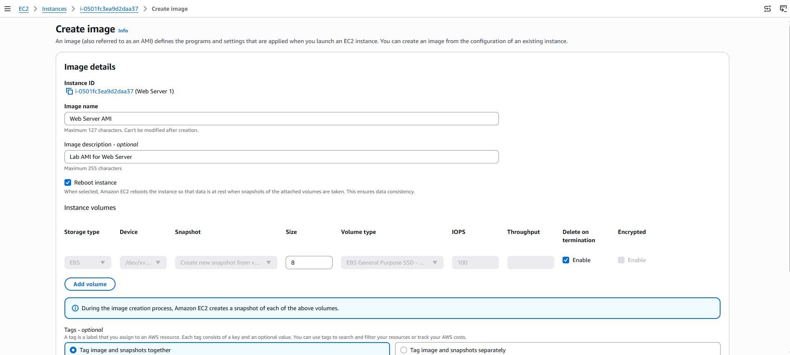
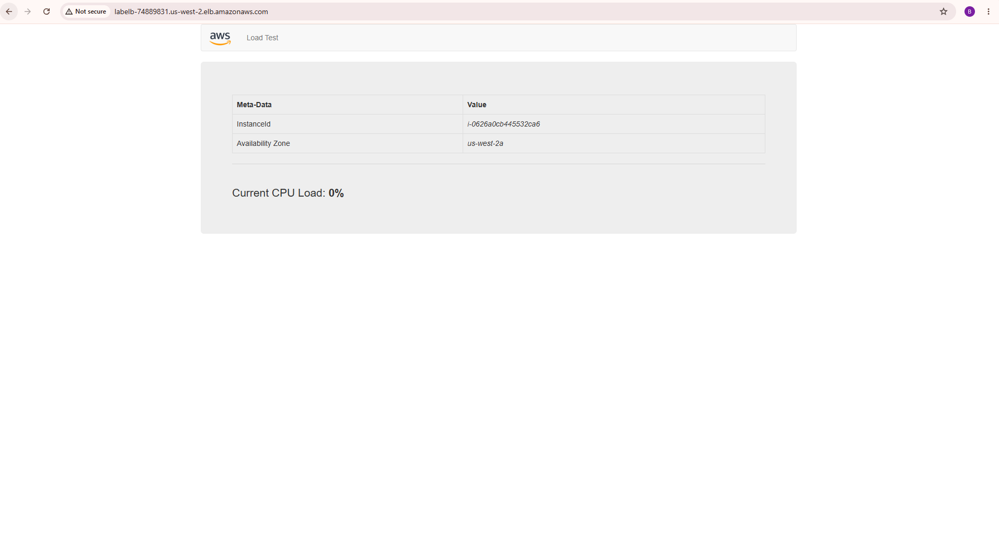
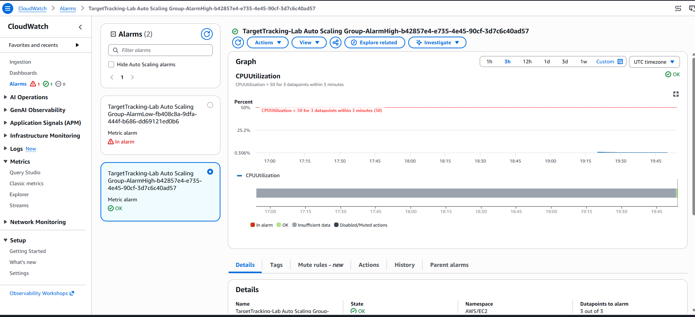
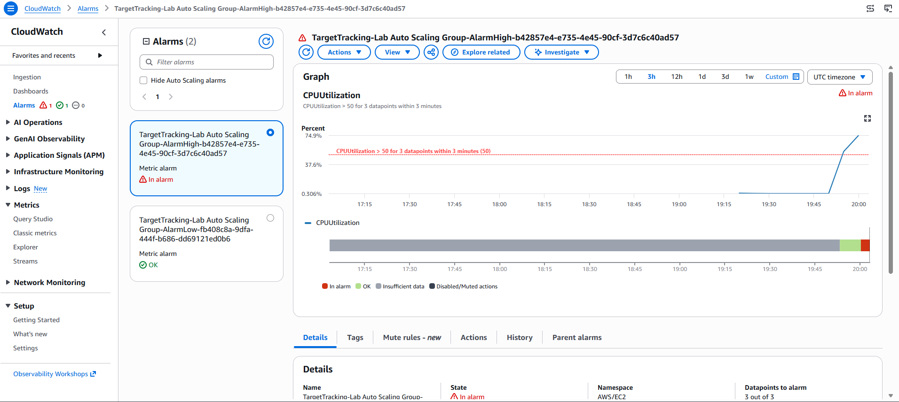
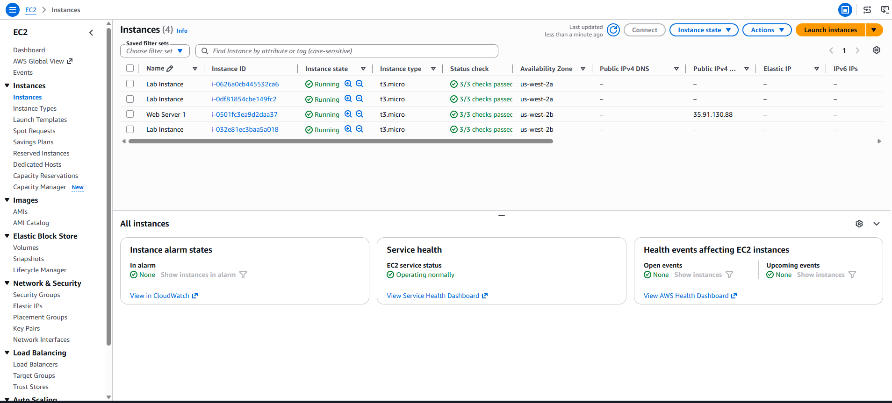
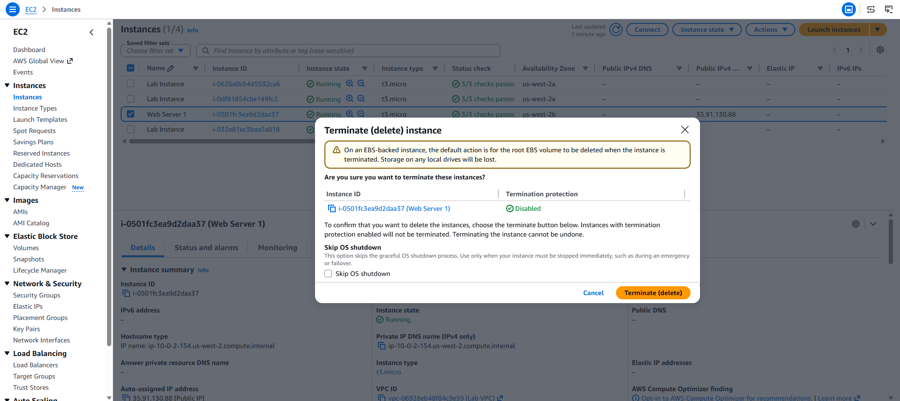

# AWS Auto Scaling and Load Balancing Lab

## Overview

In this lab, I created an Amazon Machine Image (AMI) from an existing EC2 instance and used it to build an Auto Scaling environment. I created an Application Load Balancer, target group, launch template, and Auto Scaling group. I then tested load balancing and verified that Auto Scaling launched additional EC2 instances when CPU utilization increased.

## AWS Services Used

* Amazon EC2
* Amazon Machine Images (AMI)
* Application Load Balancer
* Target Groups
* EC2 Launch Templates
* EC2 Auto Scaling
* Amazon CloudWatch

---

# Task 1: Creating an AMI for Auto Scaling

### Objective

In this task, I created an AMI from the existing **Web Server 1** EC2 instance. The AMI saves the contents of the boot disk so that new instances can later be launched with identical content.

### Steps

1. I opened the **AWS Management Console**.

2. In the Search bar, I entered `EC2`.

3. I opened the **Amazon EC2 Management Console**.

4. From the left navigation pane, I selected **Instances**.

5. I selected the running **Web Server 1** instance.

6. From **Actions**, I selected:

   **Image and templates → Create image**

7. I entered the following values:

| Setting           | Value                    |
| ----------------- | ------------------------ |
| Image name        | `Web Server AMI`         |
| Image description | `Lab AMI for Web Server` |

8. I selected **Create image**.
9. I confirmed that AWS displayed the AMI ID for the newly created image.

### Screenshot



**Screenshot:** The newly created `Web Server AMI` and its AMI ID.

---

# Task 2: Creating a Load Balancer

### Objective

In this task, I created an Application Load Balancer to distribute traffic across multiple EC2 instances and Availability Zones.

## Step 2.1: Create the Application Load Balancer

1. From the EC2 navigation pane, I selected **Load Balancers**.
2. I selected **Create load balancer**.
3. Under **Application Load Balancer**, I selected **Create**.
4. For **Load balancer name**, I entered:

```text
LabELB
```

### Network Configuration

I configured the following:

| Setting                  | Value                |
| ------------------------ | -------------------- |
| VPC                      | `Lab VPC`            |
| First Availability Zone  | `Public Subnet 1`    |
| Second Availability Zone | `Public Subnet 2`    |
| Security group           | `Web Security Group` |

5. I removed the default security group.
6. I selected **Web Security Group**.

### Screenshot


**Screenshot:** Application Load Balancer configuration showing `LabELB`, `Lab VPC`, both public subnets, and `Web Security Group`.

---

## Step 2.2: Create the Target Group

1. Under **Listeners and routing**, I selected **Create target group**.
2. In the new browser tab, I configured:

| Setting           | Value              |
| ----------------- | ------------------ |
| Target type       | `Instances`        |
| Target group name | `lab-target-group` |

3. I selected **Next**.
4. On the **Register targets** page, I selected **Create target group**.
5. I closed the Target Groups browser tab.

---

## Step 2.3: Complete the Load Balancer

1. I returned to the Load Balancer browser tab.
2. I refreshed the **Forward to** dropdown.
3. I selected:

```text
lab-target-group
```

4. I selected **Create load balancer**.
5. I confirmed that AWS displayed a successful creation message for:

```text
LabELB
```

6. I selected **View load balancer**.
7. I copied the **DNS name** and saved it for use later in the lab.

---

# Task 3: Creating a Launch Template

### Objective

In this task, I created a launch template that the Auto Scaling group would use to launch EC2 instances.

### Steps

1. I opened **EC2**.
2. From the left navigation pane, I selected **Launch Templates**.
3. I selected **Create launch template**.
4. I configured the launch template as follows:

| Setting                      | Value                                |
| ---------------------------- | ------------------------------------ |
| Launch template name         | `lab-app-launch-template`            |
| Template version description | `A web server for the load test app` |
| Auto Scaling guidance        | Selected                             |
| AMI                          | `Web Server AMI`                     |
| Instance type                | `t3.micro`                           |
| Key pair                     | `Don't include in launch template`   |
| Security group               | `Web Security Group`                 |

5. I selected **Create launch template**.
6. I confirmed that the launch template was successfully created.

### Screenshot


**Screenshot:** Successfully created `lab-app-launch-template`.

---

# Task 4: Creating an Auto Scaling Group

### Objective

In this task, I used the launch template to create an Auto Scaling group.

## Step 4.1: Create the Auto Scaling Group

1. I selected:

```text
lab-app-launch-template
```

2. From **Actions**, I selected:

```text
Create Auto Scaling group
```

3. For **Auto Scaling group name**, I entered:

```text
Lab Auto Scaling Group
```

4. I selected **Next**.

---

## Step 4.2: Configure the Network

I selected:

| Setting  | Value                            |
| -------- | -------------------------------- |
| VPC      | `Lab VPC`                        |
| Subnet 1 | `Private Subnet 1 (10.0.1.0/24)` |
| Subnet 2 | `Private Subnet 2 (10.0.3.0/24)` |

I selected **Next**.

---

## Step 4.3: Configure Load Balancing

Under **Configure advanced options**, I selected:

```text
Attach to an existing load balancer
```

Then I selected:

```text
Choose from your load balancer target groups
```

For the existing target group, I selected:

```text
lab-target-group | HTTP
```

For **Health check type**, I selected:

```text
ELB
```

I then selected **Next**.

### Screenshot

---

## Step 4.4: Configure Group Size and Scaling

I configured the Auto Scaling group as follows:

| Setting          | Value |
| ---------------- | ----: |
| Desired capacity |   `2` |
| Minimum capacity |   `2` |
| Maximum capacity |   `4` |

For the scaling policy, I selected:

```text
Target tracking scaling policy
```

I configured:

| Setting      | Value                     |
| ------------ | ------------------------- |
| Metric type  | `Average CPU utilization` |
| Target value | `50`                      |

This configuration allows Auto Scaling to adjust the number of instances to maintain average CPU utilization around 50%.

---

## Step 4.5: Add a Tag

I added the following tag:

| Key    | Value          |
| ------ | -------------- |
| `Name` | `Lab Instance` |

I then selected **Create Auto Scaling group**.

The Auto Scaling group initially launched instances to reach the desired capacity of two.

### Screenshot


---

# Task 5: Verifying That Load Balancing Is Working

### Objective

In this task, I verified that the Auto Scaling instances were running, registered with the target group, and passing their health checks.

## Step 5.1: Verify EC2 Instances

1. I opened **EC2 → Instances**.
2. I confirmed that two new instances named:

```text
Lab Instance
```

were running.

---

## Step 5.2: Verify Target Health

1. I opened **Load Balancing → Target Groups**.
2. I selected:

```text
lab-target-group
```

3. Under **Registered targets**, I confirmed that the two `Lab Instance` targets were listed.
4. I waited until both instances showed:

```text
healthy
```

A healthy status indicates that the instances passed the load balancer health check and are able to receive traffic.

### Screenshot


---

## Step 5.3: Test the Load Balancer

1. I opened a new browser tab.
2. I entered the **LabELB DNS name** that I saved earlier.
3. I pressed **Enter**.
4. The **Load Test** application appeared.

This confirmed that the load balancer received the request and forwarded it to an EC2 instance.

### Screenshot



---

# Task 6: Testing Auto Scaling

### Objective

In this task, I increased the application load to cause the Auto Scaling group to launch additional EC2 instances.

## Step 6.1: Check CloudWatch Alarms

1. I opened **CloudWatch**.
2. From the left navigation pane, I selected **Alarms → All alarms**.
3. I confirmed that two alarms were automatically created by the Auto Scaling group.
4. I selected the alarm containing:

```text
AlarmHigh
```

5. I confirmed that the initial state was:

```text
OK
```

The alarm monitors CPU utilization above the configured 50% target.

### Screenshot



---

## Step 6.2: Generate CPU Load

1. I returned to the browser tab containing the **Load Test** application.
2. Next to the AWS logo, I selected:

```text
Load Test
```

3. The application began generating a high CPU load.
4. I kept the Load Test browser tab open.

---

## Step 6.3: Monitor the Alarm

I returned to the CloudWatch console and refreshed the alarms.

The **AlarmHigh** alarm eventually changed to:

```text
In alarm
```

The CPU utilization increased above the 50% threshold, causing Auto Scaling to add capacity.

### Screenshot



---

## Step 6.4: Verify Additional Instances

1. I returned to **EC2 → Instances**.
2. I confirmed that more than two instances named:

```text
Lab Instance
```

were running.

This demonstrated that the Auto Scaling group automatically launched additional instances in response to the increased CPU utilization.

### Screenshot



---

# Task 7: Terminating the Web Server 1 Instance

### Objective

The original **Web Server 1** instance was used to create the AMI. After the Auto Scaling environment was created, the original instance was no longer required.

### Steps

1. I opened **EC2 → Instances**.
2. I selected **Web Server 1**.
3. From **Instance state**, I selected:

```text
Terminate instance
```

4. I selected **Terminate** to confirm.

### Screenshot



---


# Final Results

By completing this lab, I successfully:

* Created an **AMI** from an EC2 instance.
* Created an **Application Load Balancer**.
* Created a **target group**.
* Created an **EC2 launch template**.
* Created an **Auto Scaling group**.
* Configured Auto Scaling across two private subnets.
* Configured a target tracking scaling policy using **Average CPU utilization**.
* Set the Auto Scaling target to **50% CPU utilization**.
* Verified that EC2 instances passed the load balancer health checks.
* Tested the application through the Application Load Balancer.
* Used **CloudWatch alarms** to monitor CPU utilization.
* Generated additional CPU load and verified that Auto Scaling launched additional instances.
* Terminated the original **Web Server 1** instance.
