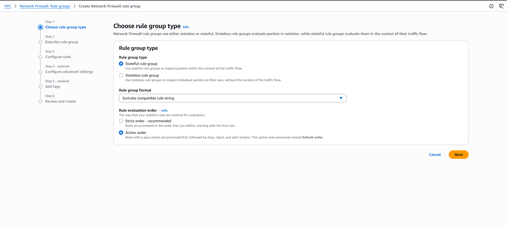
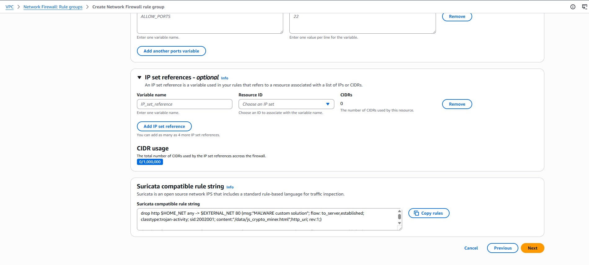

# AWS Network Firewall Lab

## Overview

In this lab, I configured **AWS Network Firewall** to identify and block access to malicious files hosted on a known testing website.

I first confirmed that the malicious files were reachable from an EC2 instance. I then inspected the existing firewall configuration, created a **stateful Suricata rule group**, attached it to the firewall policy, and tested the configuration to confirm that the malicious files were successfully blocked.

---

# Task 1: Confirm Reachability

In this task, I connected to the pre-configured **TestInstance** EC2 instance and used the `wget` command to confirm that the malicious files were accessible.

`wget` is a command-line utility used to download files from a network location.

### 1. Access the TestInstance

1. From the Vocareum console, I selected **AWS Details**.
2. Next to **TestInstanceURL**, I copied the provided link.
3. I opened the link in a new browser tab.

The link opened the **TestInstance** EC2 instance using AWS Systems Manager Session Manager.

### 2. Check the working directory

I changed to my home directory and confirmed the current working directory:

```bash
cd ~
pwd
```

### 3. Download the first test file

I used `wget` to access the first malware test file:

```bash
wget http://malware.wicar.org/data/js_crypto_miner.html
```

### 4. Download the second test file

I then downloaded the second malware test file:

```bash
wget http://malware.wicar.org/data/java_jre17_exec.html
```

> **Note:** These files are provided specifically for anti-malware testing and educational purposes. They should only be accessed within the protected lab environment.

### 5. Confirm the downloads

I used the `ls` command to verify that the files were downloaded:

```bash
ls
```

The output showed:

```text
java_jre17_exec.html
js_crypto_miner.html
```

### Screenshot

Then I executed the commands to download the test malware files. Both requests returned a 200 OK response, confirming successful access.

```bash
```bash
sh-4.2$ cd ~
sh-4.2$ pwd
/home/ssm-user
sh-4.2$ wget http://malware.wicar.org/data/js_crypto_miner.html
--2026-08-23 19:19:39--  http://malware.wicar.org/data/js_crypto_miner.html
Resolving malware.wicar.org (malware.wicar.org)... 208.94.116.246, 2607:ff18:80:6::6a08
Connecting to malware.wicar.org (malware.wicar.org)|208.94.116.246|:80... connected.
HTTP request sent, awaiting response... 200 OK
Length: 366 [text/html]
Saving to: ‘js_crypto_miner.html’

100%[=========================================================================================================================================================================>] 366         --.-K/s   in 0s

2026-08-23 19:19:39 (56.9 MB/s) - ‘js_crypto_miner.html’ saved [366/366]

sh-4.2$ wget http://malware.wicar.org/data/java_jre17_exec.html
--2026-08-23 19:19:51--  http://malware.wicar.org/data/java_jre17_exec.html
Resolving malware.wicar.org (malware.wicar.org)... 208.94.116.246, 2607:ff18:80:6::6a08
Connecting to malware.wicar.org (malware.wicar.org)|208.94.116.246|:80... connected.
HTTP request sent, awaiting response... 200 OK
Length: 129 [text/html]
Saving to: ‘java_jre17_exec.html’

100%[=========================================================================================================================================================================>] 129         --.-K/s   in 0s

2026-08-23 19:19:52 (21.7 MB/s) - ‘java_jre17_exec.html’ saved [129/129]

sh-4.2$
```

To verify the downloads, I listed the directory contents and confirmed that both files were present.

```bash
sh-4.2$ ls
java_jre17_exec.html  js_crypto_miner.html
sh-4.2$
```

### Task 1 Summary

I confirmed that the malicious URLs were reachable from the TestInstance EC2 instance. The files were successfully downloaded, showing that the current network firewall configuration was allowing access to the malicious website.

---

# Task 2: Inspect the Network Firewall

In this task, I inspected the pre-configured **AWS Network Firewall** and updated the firewall policy so that traffic would be forwarded to the stateful rule engine for deeper inspection.

### 1. Open AWS Network Firewall

1. In the AWS Management Console, I searched for **VPC**.
2. I opened the **VPC** service.
3. In the left navigation pane, under **NETWORK FIREWALL**, I selected **Firewalls**.
4. I selected **LabFirewall**.

### 2. Open the firewall policy

From the **Overview** section, I opened the **LabFirewallPolicy** associated with the firewall.

A firewall policy defines how traffic is handled using stateless and stateful rule groups.

### 3. Configure stateless default actions

Under **Stateless default actions**, I selected **Edit**.

I configured the following:

| Setting                                | Configuration                        |
| -------------------------------------- | ------------------------------------ |
| Choose how to treat fragmented packets | Use the same actions for all packets |
| Action                                 | Forward to stateful rule groups      |

I then selected **Save**.

### Screenshot


### Task 2 Summary

I updated the firewall policy so that packets are forwarded to the **stateful rule engine**. This allows AWS Network Firewall to inspect traffic using more advanced rules.

---

# Task 3: Create a Firewall Rule Group

In this task, I created a **stateful firewall rule group** using Suricata-compatible IPS rules.

The rule group contains rules that identify and block requests to the malicious test URLs.

### 1. Create the rule group

From the VPC console:

1. Under **NETWORK FIREWALL**, I selected **Network Firewall Rule Groups**.
2. I selected **Create Network Firewall rule group**.

I configured the rule group as follows:

| Setting               | Value                           |
| --------------------- | ------------------------------- |
| Rule group type       | Stateful rule group             |
| Rule group format     | Suricata compatible rule string |
| Rule evaluation order | Action order                    |
| Name                  | `StatefulRuleGroup`             |
| Capacity              | `100`                           |

I selected **Next**.

### 2. Add the Suricata rules

In the **Suricata compatible IPS rules** section, I entered the following rules:

```text
drop http $HOME_NET any -> $EXTERNAL_NET 80 (msg:"MALWARE custom solution"; flow:to_server,established; classtype:trojan-activity; sid:2002001; content:"/data/js_crypto_miner.html"; http_uri; rev:1;)
```

```text
drop http $HOME_NET any -> $EXTERNAL_NET 80 (msg:"MALWARE custom solution"; flow:to_server,established; classtype:trojan-activity; sid:2002002; content:"/data/java_jre17_exec.html"; http_uri; rev:1;)
```

These rules instruct the firewall to **drop HTTP requests** that contain the specified malicious file paths.

### 3. Create the rule group

I selected **Next** until I reached **Review and create**.

I reviewed the configuration and selected:

**Create stateful rule group**

### Screenshot





### Task 3 Summary

I created a stateful Network Firewall rule group containing two Suricata rules. The rules identify requests for the two malicious test files and block the traffic.

---

# Task 4: Attach the Rule Group to the Network Firewall

In this task, I attached the `StatefulRuleGroup` to the existing firewall policy.

### 1. Open the firewall

1. Under **NETWORK FIREWALL**, I selected **Firewalls**.
2. I selected **LabFirewall**.
3. Under **Associated firewall policy**, I selected **LabFirewallPolicy**.

### 2. Add the stateful rule group

Under **Stateful rule groups**, I selected the dropdown menu.

I chose:

**Add unmanaged stateful rule groups**

I selected the checkbox for:

```text
StatefulRuleGroup
```

I then selected:

**Add stateful rule group**

A green confirmation message appeared indicating that the firewall policy was successfully updated.

### 3. Verify the rule group

I scrolled to the **Stateful rule groups** section and confirmed that `StatefulRuleGroup` was listed.

### Screenshot


### Task 4 Summary

I successfully attached the stateful rule group to the firewall policy. The firewall can now use the Suricata rules to block requests to the malicious test files.

---

# Task 5: Validate the Solution

In this task, I tested the firewall configuration to confirm that the malicious files could no longer be downloaded.

### 1. Connect to TestInstance

1. In the AWS Management Console, I searched for **EC2**.
2. I selected **Instances**.
3. I selected **TestInstance**.
4. I selected **Connect**.
5. I opened the **Session Manager** tab.
6. I selected **Connect**.

### 2. Check the working directory

I changed to my home directory:

```bash
cd ~
pwd
```

### 3. Test the first malicious URL

I attempted to download the first test file:

```bash
wget http://malware.wicar.org/data/js_crypto_miner.html
```

The request no longer completed successfully.

The output stopped at:

```text
HTTP request sent, awaiting response...
```

This confirmed that the firewall was preventing access to the malicious file.

```bash
sh-4.2$ cd ~
sh-4.2$ pwd
/home/ssm-user
sh-4.2$ wget http://malware.wicar.org/data/js_crypto_miner.html
--2026-08-23 19:45:41--  http://malware.wicar.org/data/js_crypto_miner.html
Resolving malware.wicar.org (malware.wicar.org)... 208.94.116.246, 2607:ff18:80:6::6a08
Connecting to malware.wicar.org (malware.wicar.org)|208.94.116.246|:80... connected.
HTTP request sent, awaiting response...

I pressed:

```text
Ctrl+C
```

to stop the command.

### 4. Test the second malicious URL

I then tested the second URL:

```bash
wget http://malware.wicar.org/data/java_jre17_exec.html
```

The request was also blocked by the network firewall.


### 5. Remove the test files

I removed the files that were downloaded during the initial reachability test:

```bash
rm java_jre17_exec.html js_crypto_miner.html
```

### 6. Confirm the files were removed

I ran:

```bash
ls
```

The files were no longer present.

```bash
sh-4.2$ rm java_jre17_exec.html js_crypto_miner.html
sh-4.2$ ls
sh-4.2$


### Task 5 Summary

I successfully validated the Network Firewall configuration. The `wget` requests to the malicious test files were blocked after the stateful Suricata rules were attached to the firewall policy.

---

# Conclusion

I successfully completed the AWS Network Firewall lab.

During the lab, I:

* Confirmed that malicious URLs were initially reachable.
* Connected to an EC2 instance using Session Manager.
* Inspected the existing AWS Network Firewall configuration.
* Updated the firewall policy to forward traffic to stateful rule groups.
* Created a stateful Network Firewall rule group.
* Added Suricata IPS rules to block malicious URLs.
* Attached the rule group to the firewall policy.
* Tested the firewall using `wget`.
* Confirmed that access to the malicious files was successfully blocked.
* Removed the downloaded test files from the EC2 instance.

This lab demonstrated how **AWS Network Firewall and Suricata rules can be used to inspect and block unwanted network traffic**.
