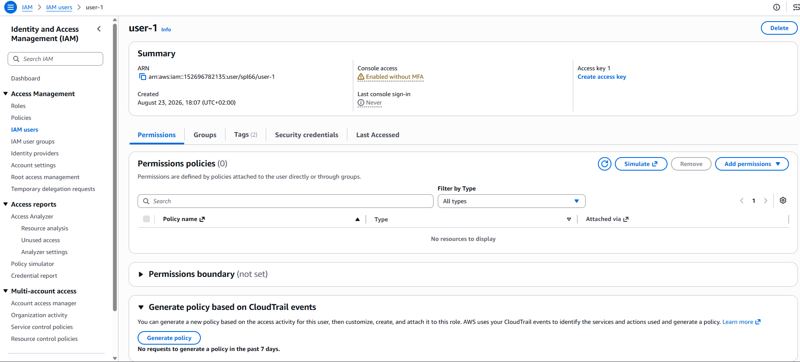
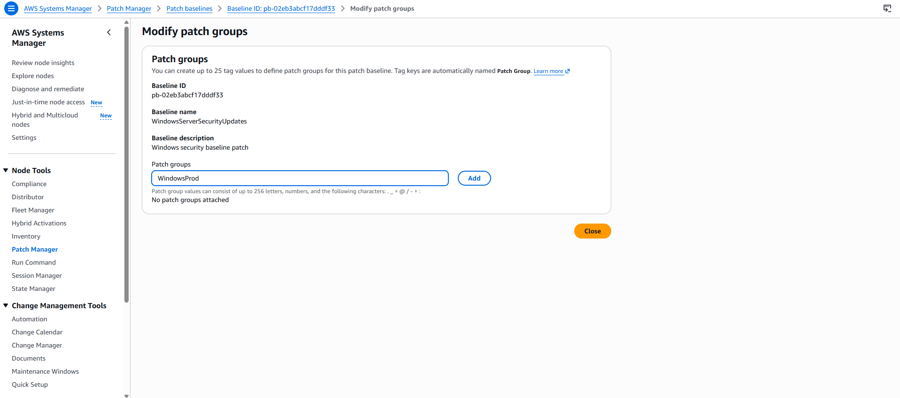
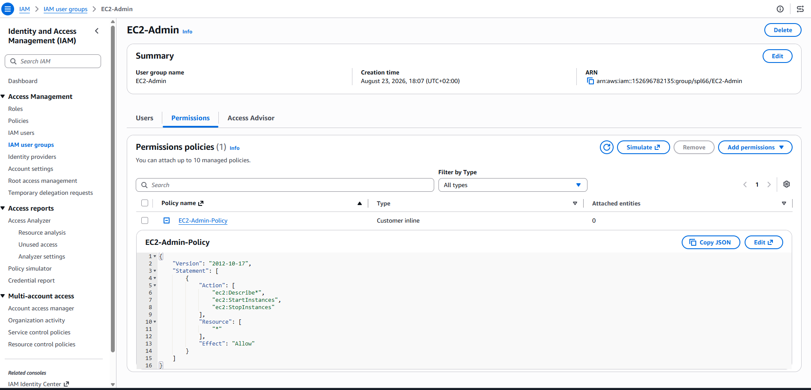
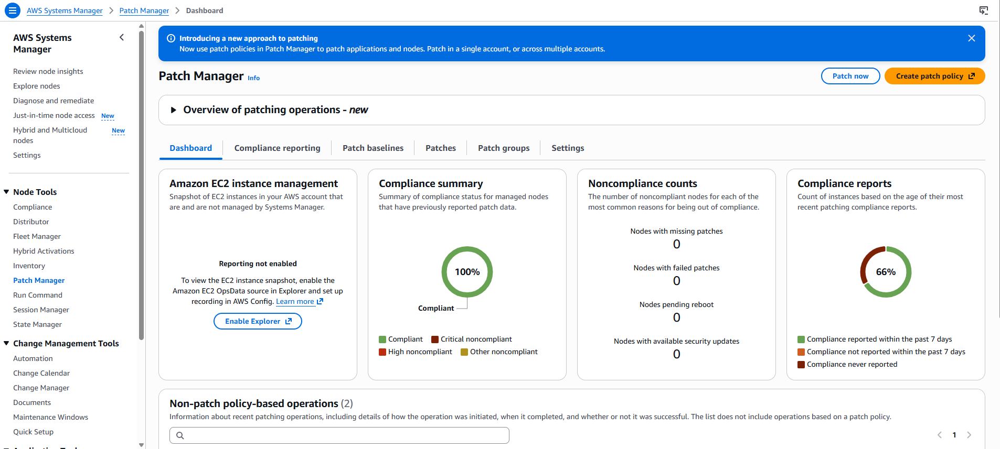
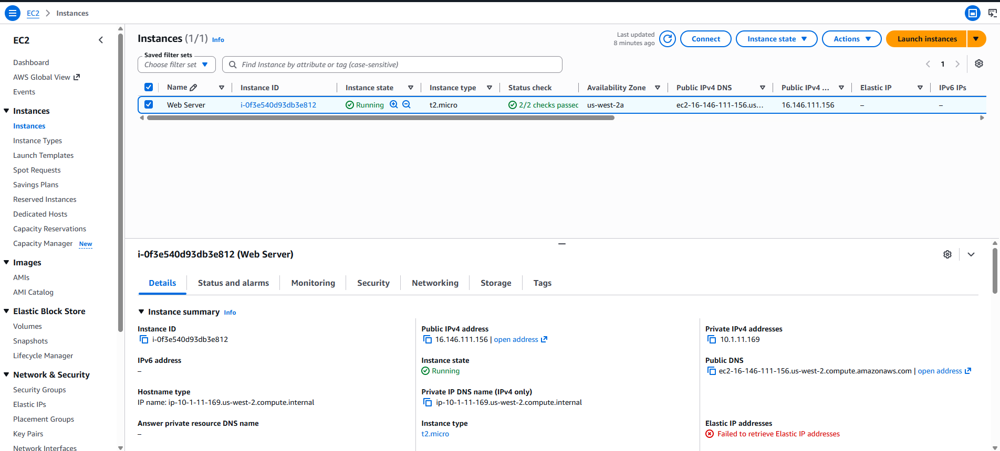
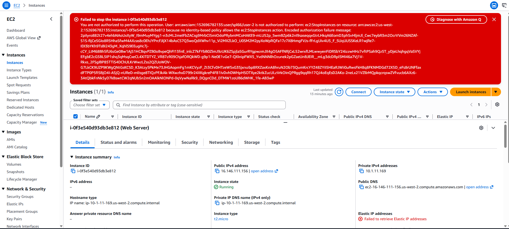
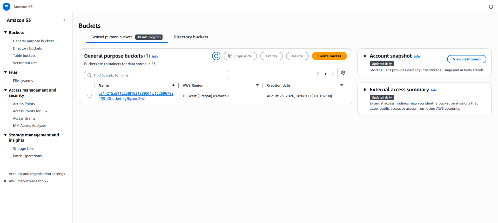
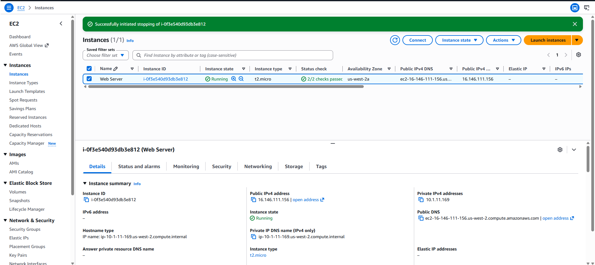
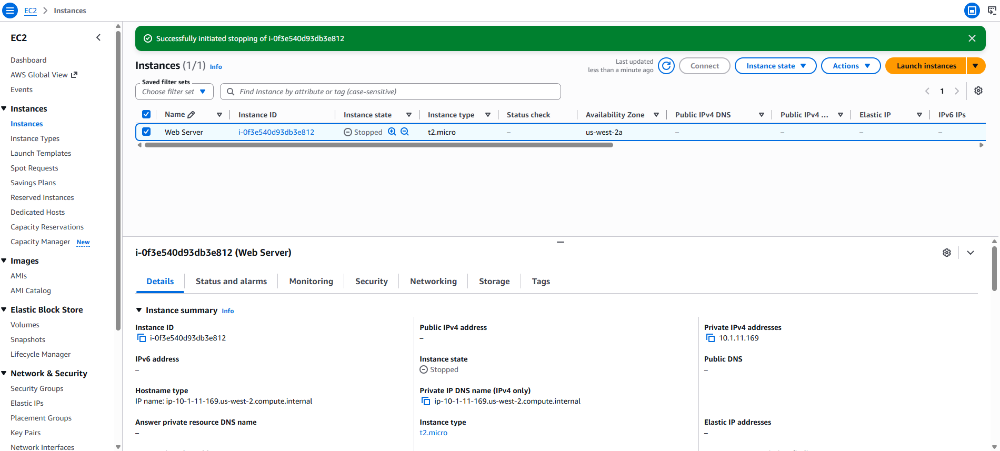

# AWS IAM – Password Policy, Users, Groups, and Permissions

## Objective

In this lab, I configured an AWS Identity and Access Management (IAM) password policy, explored pre-created IAM users and user groups, assigned users to groups, and tested how IAM policies control access to AWS services.

---

# Task 1: Create an Account Password Policy

## Objective

I created a custom password policy for the AWS account to strengthen password security for all IAM users.

## Configuration

I opened **IAM → Account settings** and selected **Change password policy**.

I configured the following password requirements:

| Setting                                          | Configuration     |
| ------------------------------------------------ | ----------------- |
| Minimum password length                          | **10 characters** |
| Require at least one uppercase letter            | **Enabled**       |
| Require at least one lowercase letter            | **Enabled**       |
| Require at least one number                      | **Enabled**       |
| Require at least one non-alphanumeric character  | **Enabled**       |
| Password expiration                              | **90 days**       |
| Prevent password reuse                           | **5 passwords**   |
| Password expiration requires administrator reset | **Disabled**      |

After configuring the requirements, I selected **Save changes**.

## Result

The custom password policy was successfully applied at the AWS account level.


---

# Task 2: Explore IAM Users and User Groups

## IAM Users

I opened **IAM → Users** and reviewed the pre-created users:

* `user-1`
* `user-2`
* `user-3`



### user-1

I inspected `user-1` and confirmed that:

* No permissions were directly attached.
* The user was not initially a member of any group.
* A console password was configured.





This demonstrated that permissions can be provided through IAM groups rather than attaching policies directly to individual users.

---

## IAM User Groups

I reviewed the following pre-created groups:

* `EC2-Admin`
* `EC2-Support`
* `S3-Support`

### EC2-Support

The **EC2-Support** group had the managed policy:

`AmazonEC2ReadOnlyAccess`

This policy provides read-only access to EC2-related resources.

The policy allows actions such as viewing and describing resources but does not allow users to modify or stop EC2 instances.

---

### S3-Support

The **S3-Support** group had the managed policy:

`AmazonS3ReadOnlyAccess`

This policy provides read-only access to Amazon S3 resources, allowing users to list and view S3 resources without making changes.

---

### EC2-Admin

The **EC2-Admin** group used a customer inline policy named:

`EC2-Admin-Policy`

Unlike managed policies, an inline policy is directly associated with a specific IAM user or group.

The policy allowed the user to:

* View EC2 resources
* Describe EC2 instances
* Start EC2 instances
* Stop EC2 instances

---

## IAM Policy Structure

While inspecting the policies, I reviewed the three main components of an IAM policy statement:

| Component    | Purpose                                              |
| ------------ | ---------------------------------------------------- |
| **Effect**   | Determines whether an action is allowed or denied    |
| **Action**   | Defines the AWS API actions that can be performed    |
| **Resource** | Defines which AWS resources the permissions apply to |

For example, an action such as `cloudwatch:ListMetrics` allows an IAM principal to perform the specified CloudWatch API operation.

---

# Business Scenario

The lab used the following access model:

| IAM User | IAM Group     | Permissions                         |
| -------- | ------------- | ----------------------------------- |
| `user-1` | `S3-Support`  | Read-only access to Amazon S3       |
| `user-2` | `EC2-Support` | Read-only access to Amazon EC2      |
| `user-3` | `EC2-Admin`   | View, start, and stop EC2 instances |

This demonstrated how IAM groups can be used to assign permissions based on a user's job function.

---

# Task 3: Add Users to User Groups

## Add user-1 to S3-Support

I opened:

**IAM → User groups → S3-Support → Users**

I selected **Add users**, selected `user-1`, and added the user to the group.

### Result

`user-1` inherited the permissions provided by:

`AmazonS3ReadOnlyAccess`

---

## Add user-2 to EC2-Support

I added `user-2` to the:

`EC2-Support`

group.

### Result

`user-2` inherited the permissions provided by:

`AmazonEC2ReadOnlyAccess`

---

## Add user-3 to EC2-Admin

I added `user-3` to the:

`EC2-Admin`

group.

### Result

`user-3` inherited the permissions provided by the `EC2-Admin-Policy` inline policy.

The final group membership was:

| Group       | User     | Access             |
| ----------- | -------- | ------------------ |
| S3-Support  | `user-1` | S3 read-only       |
| EC2-Support | `user-2` | EC2 read-only      |
| EC2-Admin   | `user-3` | EC2 administration |

Each group showed **1 user** after the assignments were completed.

---

# Task 4: Sign In and Test User Permissions

## IAM Sign-In URL

From the IAM Dashboard, I located the:

**Sign-in URL for IAM users in this account**

I copied the URL and used a private/incognito browser window to test each IAM user's permissions independently.



---

## Test 1: user-1 – S3 Support

I signed in as:

```text
Username: user-1
Password: Lab-Password1
```

I opened **Amazon S3** and was able to view the available S3 buckets and their contents.



### EC2 Access Test

I then opened **Amazon EC2 → Instances**.

The following authorization error was displayed:

```text
You are not authorized to perform this operation.
```







`user-1` could access S3 but could not access EC2.

| Service    | Access      |
| ---------- | ----------- |
| Amazon S3  | ✅ Read-only |
| Amazon EC2 | ❌ No access |

This confirmed that the `S3-Support` group policy was working as expected.

---

# Test 2: user-2 – EC2 Support

I signed out of `user-1` and signed in as:

```text
Username: user-2
Password: Lab-Password2
```

I opened **Amazon EC2 → Instances**.

I was able to view the EC2 instance because `user-2` had read-only EC2 permissions.

I then attempted to stop the EC2 instance.

### Result

The operation failed with an authorization error:

```text
Failed to stop the instance.
You are not authorized to perform this operation.
```

This confirmed that the `AmazonEC2ReadOnlyAccess` policy allows viewing EC2 resources but does not allow administrative actions.

### S3 Access Test

I opened Amazon S3 and received a permissions error indicating that I could not list the buckets.

| Service           | Access        |
| ----------------- | ------------- |
| Amazon EC2        | ✅ Read-only   |
| Amazon S3         | ❌ No access   |
| Stop EC2 instance | ❌ Not allowed |


(./images/SE-04-user2-s3-denied.png)

---

# Test 3: user-3 – EC2 Administrator

I signed out of `user-2` and signed in as:

```text
Username: user-3
Password: Lab-Password3
```

I opened:

**Amazon EC2 → Instances**

The EC2 instance was visible.

I selected the instance and chose:

**Instance state → Stop instance**

I confirmed the action by selecting **Stop**.




The EC2 instance entered the:

```text
Stopping
```

state.

This confirmed that `user-3` had the permissions required to administer EC2 instances.

| Service/Action      | Access    |
| ------------------- | --------- |
| View EC2 instances  | ✅ Allowed |
| Start EC2 instances | ✅ Allowed |
| Stop EC2 instances  | ✅ Allowed |

---

# Permissions Testing Summary

| User     | Group       | S3 | EC2 View | Stop EC2 |
| -------- | ----------- | -: | -------: | -------: |
| `user-1` | S3-Support  |  ✅ |        ❌ |        ❌ |
| `user-2` | EC2-Support |  ❌ |        ✅ |        ❌ |
| `user-3` | EC2-Admin   |  ❌ |        ✅ |        ✅ |

---

# Key Takeaways

Through this lab, I learned how IAM can be used to control access to AWS resources based on user roles.

### IAM Password Policies

I created an account-level password policy with stronger password requirements, including a minimum length of 10 characters, password expiration, and password reuse prevention.

### IAM Groups

I learned that IAM groups allow permissions to be assigned based on job responsibilities instead of configuring permissions individually for every user.

### Managed Policies

I worked with AWS-managed policies such as:

* `AmazonS3ReadOnlyAccess`
* `AmazonEC2ReadOnlyAccess`

These policies provide predefined permissions that can be attached to users or groups.

### Inline Policies

I also inspected a customer inline policy:

`EC2-Admin-Policy`

This demonstrated how permissions can be created specifically for a particular group or use case.

### Least Privilege

The permission tests demonstrated the **principle of least privilege**. Each user received only the permissions required for their assigned role.

---

# Conclusion

I successfully completed the IAM lab by:

* Created and applied a custom AWS account password policy.
* Explored IAM users and user groups.
* Inspected managed and inline IAM policies.
* Added users to groups according to their job functions.
* Located and used the IAM user sign-in URL.
* Tested S3 and EC2 permissions for each IAM user.
* Verified read-only versus administrative permissions.
* Demonstrated how IAM policies control access to AWS resources.

The lab provided practical experience with **IAM users, groups, policies, permissions, authentication, authorization, and least-privilege access control**.

