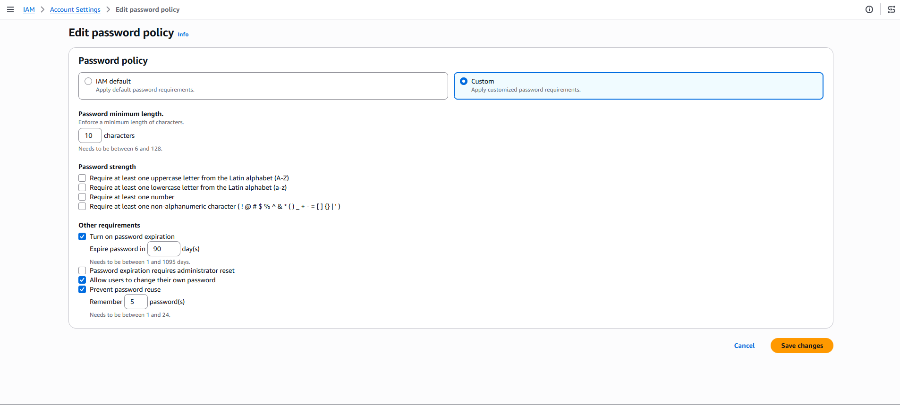

# Amazon Inspector – Lambda Vulnerability Scanning and Remediation

## Overview

In this lab, I used **Amazon Inspector** to scan AWS Lambda functions for software vulnerabilities. I activated Inspector, reviewed the security findings, investigated a vulnerable Python package, and then remediated the issue by updating the package used by the Lambda function.

The main vulnerability I investigated was:

**CVE-2023-32681 - requests**

The remediation involved updating the `requests` package in the Lambda function and then verifying that Amazon Inspector detected the updated function and closed the vulnerability finding.

---

# Task 1: Activating Amazon Inspector

## Objective

The first part of the lab involved enabling Amazon Inspector so that I could scan the Lambda functions in my AWS environment for known security vulnerabilities.

## What I Did

I opened the AWS Management Console and searched for **Amazon Inspector**. Since Inspector had not previously been activated in the lab environment, I selected the option to activate the service.

After activation, Inspector displayed a message indicating that the initial scan was in progress.

I then monitored the Inspector dashboard while the initial scan was running.

## Environment Coverage

Once the scan completed, I checked the Inspector dashboard and confirmed that the Lambda functions had reached **100% environment coverage**.

This confirmed that Amazon Inspector was successfully enabled and had started scanning the Lambda environment.

## Evidence

**Amazon Inspector activation and Lambda coverage:**



> **Screenshot:** Inspector dashboard showing the Lambda functions environment coverage.

---

# Task 2: Reviewing the Inspector Findings

## Objective

After activating Inspector, I reviewed the security findings generated from the Lambda functions. This allowed me to identify the vulnerable resources and understand why they were being reported.

## Reviewing the Findings

I opened **Findings → All findings** in Amazon Inspector.

The findings showed vulnerabilities affecting the Lambda functions. I reviewed the severity, affected resources, and vulnerability titles to determine which issue needed to be investigated.

One of the findings I identified was:

**CVE-2023-32681 - requests**

The finding had a **Medium** severity rating and identified a Lambda function as the impacted resource.

## Vulnerability Investigation

I selected the `CVE-2023-32681 - requests` finding to view the detailed vulnerability information.

Within the vulnerability details, I reviewed the **Vulnerability ID** and followed the external reference to the **National Vulnerability Database (NVD)** to understand the vulnerability in more detail.

I also reviewed the **Remediation** information provided by Amazon Inspector.

The remediation indicated that the version of the Python `requests` package being used by the Lambda function was vulnerable and needed to be updated.

## Evidence – Inspector Findings


> **Screenshot:** Amazon Inspector showing the `CVE-2023-32681 - requests` finding.

## Evidence – Vulnerability Details


> **Screenshot:** Vulnerability details and remediation information for the `requests` package.

---

# Task 3: Remediating the Lambda Vulnerability

## Objective

The next stage of the lab involved applying the recommended remediation to the affected Lambda function and then verifying that Amazon Inspector no longer reported the vulnerability as active.

## Updating the Lambda Function

I opened the **AWS Lambda** console and selected the affected function:

**`get-request`**

I then opened the `requirements.txt` file in the Lambda code editor.

The function was originally using the following version of the `requests` package:

```text
requests==2.20.0
```

I identified this as the package version associated with the Inspector finding.

To remediate the vulnerability, I changed the dependency to:

```text
requests
```

This removed the fixed version requirement and allowed the Lambda deployment to use an updated version of the package.

## Evidence – Updated Package


> **Screenshot:** The `requirements.txt` file after changing the vulnerable package dependency.

---

## Deploying the Updated Lambda Function

After making the change, I deployed the updated Lambda function.

The deployment completed successfully and the function was updated.

This deployment also triggered Amazon Inspector to perform another scan of the Lambda function.

---

# Verifying the Remediation

## Checking the Inspector Finding

After deploying the updated Lambda function, I returned to Amazon Inspector and opened:

**Findings → All findings**

I changed the finding status from **Active** to **Closed**.

I then searched for:

**CVE-2023-32681 - requests**

The vulnerability appeared under the **Closed** findings.

This confirmed that the vulnerable package had been successfully remediated.

## Evidence – Closed Finding


> **Screenshot:** Amazon Inspector showing `CVE-2023-32681 - requests` as a closed finding.

---

# Verifying the Latest Lambda Scan

I also checked the **Resources coverage → Lambda functions** section in Amazon Inspector.

The **Last scanned** timestamp for the Lambda function had been updated following the deployment.

This provided additional confirmation that Inspector had scanned the updated version of the Lambda function.

## Evidence – Last Scanned


> **Screenshot:** Inspector showing the updated `Last scanned` timestamp for the Lambda function.

---

# Results

The lab was completed successfully.

I:

* Activated **Amazon Inspector** for the AWS environment.
* Confirmed that the Lambda functions reached **100% environment coverage**.
* Reviewed the vulnerabilities identified by Inspector.
* Investigated **CVE-2023-32681 - requests**.
* Identified the vulnerable `requests` package version in the `get-request` Lambda function.
* Updated the package dependency in `requirements.txt`.
* Deployed the updated Lambda function.
* Waited for Amazon Inspector to perform a new scan.
* Confirmed that the vulnerability appeared under **Closed findings**.
* Verified that the Lambda function had a new **Last scanned** timestamp.

## Key Learning

This lab demonstrated how **Amazon Inspector** can be used to continuously identify software vulnerabilities in AWS resources such as Lambda functions.

I also learned how Inspector findings can be used to identify a vulnerable third-party dependency and how updating the dependency can remediate the vulnerability. Finally, I verified the remediation through the Inspector findings and the updated scan timestamp.

---

# Screenshots

The following screenshots provide evidence of the work completed during the lab:

| Task   | Evidence                                               |
| ------ | ------------------------------------------------------ |
| Task 1 | Amazon Inspector activated and Lambda coverage at 100% |
| Task 2 | Lambda vulnerability findings                          |
| Task 2 | CVE-2023-32681 vulnerability details                   |
| Task 3 | Updated `requirements.txt`                             |
| Task 3 | Vulnerability shown as Closed                          |
| Task 3 | Updated Lambda Last Scanned timestamp                  |

---

# Technologies Used

* **Amazon Inspector**
* **AWS Lambda**
* **Amazon Web Services (AWS)**
* **Python**
* **Python `requests` package**
* **National Vulnerability Database (NVD)**
* **CVE vulnerability management**


